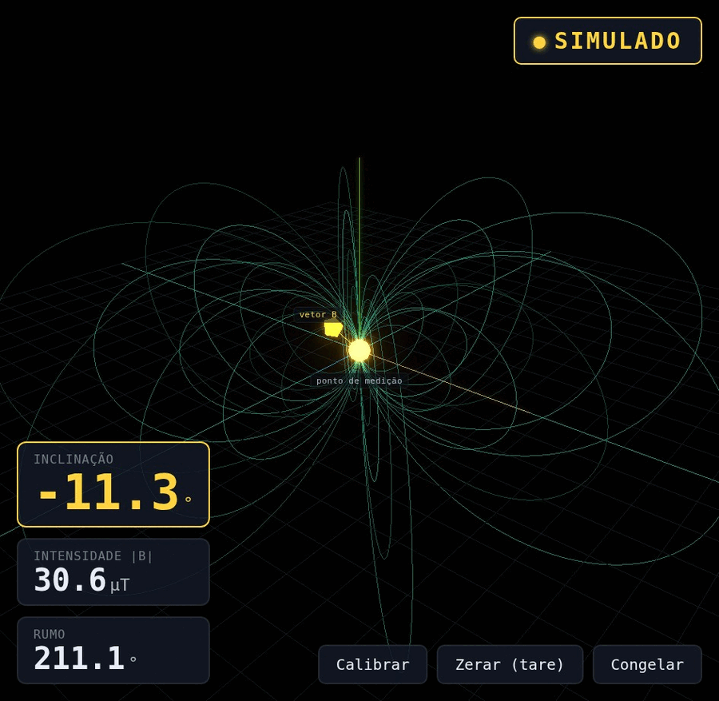
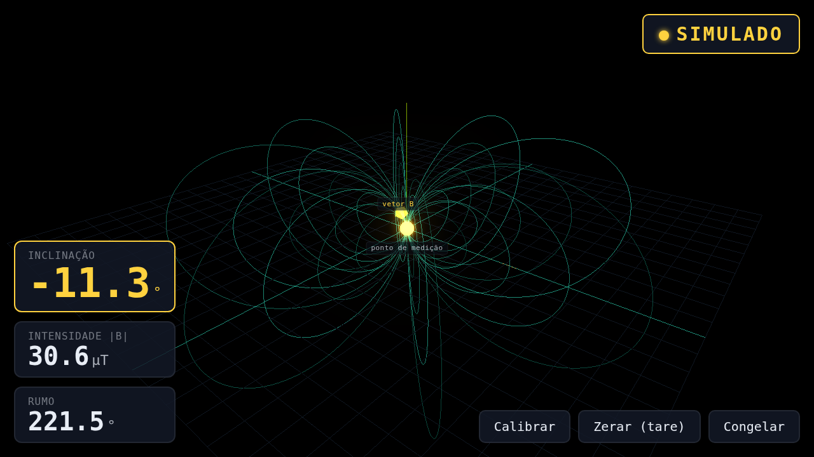
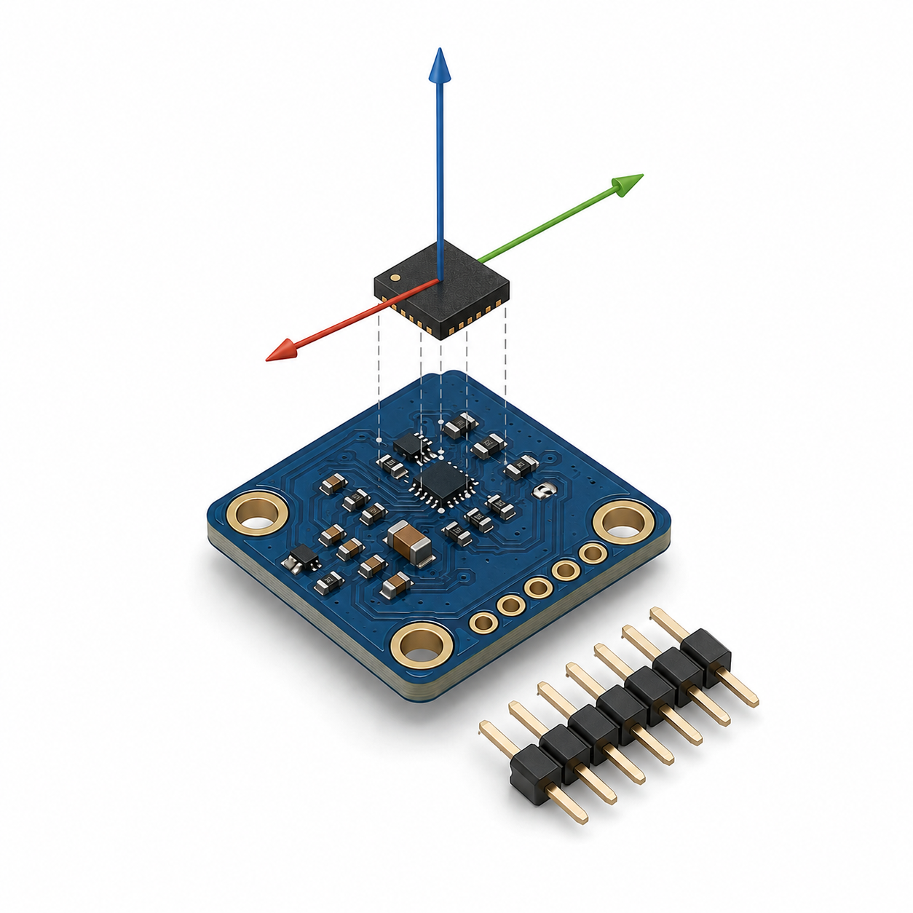

# Magnetorrecepção na Raposa Ártica

Demonstração de eletromagnetismo aplicado: um ESP32 com magnetômetro lê o campo
magnético da sala em tempo real e transmite para uma página web, que desenha o vetor
do campo em 3D e mostra a inclinação, a intensidade e o rumo. Projeto criado como a
parte prática de um seminário de Eletromagnetismo Aplicado (UFC, Campus Sobral).

A ideia central: o mesmo campo que se supõe guiar uma raposa na caça é o campo que o
sensor de um celular lê para achar o norte. Aqui a gente fabrica esse sensor e mede o
campo ao vivo.



## Demonstração em vídeo

Assista à demonstração completa no YouTube: **https://www.youtube.com/watch?v=2cIvMzCbPyE**

[](https://www.youtube.com/watch?v=2cIvMzCbPyE)

## O que ele faz

- Lê o vetor do campo magnético (três eixos) com um magnetômetro AMR.
- Detecta automaticamente qual chip está conectado (QMC5883P, QMC5883L ou HMC5883L).
- Aplica calibração hard-iron (movimento em figura de oito) e salva na memória do ESP32.
- Calcula inclinação, intensidade e rumo a partir do vetor.
- Transmite a telemetria por WebSocket a 10 Hz.
- A página web desenha o vetor em 3D (Three.js) e mostra as grandezas em tempo real.
- Se o hardware não estiver presente, a página cai para um modo simulado sozinha.

Em Sobral, sobre o equador magnético, a inclinação medida fica baixa (campo quase
deitado), o que confirma na prática a previsão do modelo de dipolo. Ao aproximar um
objeto de aço, o vetor salta: é o mesmo princípio da detecção de anomalia magnética.

## Como funciona

```
QMC5883P / QMC5883L / HMC5883L   (sensor AMR, barramento I2C)
        |
     ESP32   (calibração hard-iron + tare, cálculo das grandezas)
        |   WebSocket 10 Hz   (ponto de acesso Wi-Fi próprio)
        v
   Página web   (Three.js: vetor 3D + leitura numérica)
```



## Componentes necessários

| Componente | Observação |
|---|---|
| Placa ESP32 DevKit (DOIT, ESP32-WROOM-32) | qualquer DevKit com ESP32 serve |
| Módulo magnetômetro | GY-271 (HMC5883L ou QMC5883L) ou QMC5883P |
| Protoboard e jumpers macho-fêmea | para as 4 ligações I2C |
| Cabo USB (micro-USB ou USB-C, conforme a placa) | alimentação e gravação |
| Um ímã ou objeto de aço | para o efeito de anomalia na demo |

### Onde comprar (Brasil)

Procure por "ESP32 DevKit" e "módulo GY-271" ou "QMC5883L" em:

- SmartKits (smartkits.com.br)
- Usinainfo (usinainfo.com.br)
- RoboCore (robocore.net)
- Mercado Livre (mercadolivre.com.br)
- AliExpress (aliexpress.com), mais barato, prazo maior

O módulo costuma vir rotulado como GY-271; o chip pode ser HMC5883L ou QMC5883L, e o
firmware lida com os dois automaticamente.

## Montagem (ligação I2C)

| Módulo do sensor | ESP32 |
|---|---|
| VCC | 3V3 |
| GND | GND |
| SDA | GPIO21 |
| SCL | GPIO22 |

Ligue o sensor a alguns centímetros de metal e mantenha a placa nivelada para a leitura
de inclinação ficar correta.

## Como subir o firmware na placa

O firmware usa [PlatformIO](https://platformio.org/). A forma mais simples é instalar a
extensão PlatformIO no VS Code; pela linha de comando também funciona.

```bash
cd firmware
pio run -e esp32doit-devkit-v1 -t upload
```

Para acompanhar a saída serial (scan I2C, qual chip respondeu, leituras):

```bash
pio device monitor -b 115200
```

Ao ligar, o ESP32 cria um ponto de acesso Wi-Fi próprio (rede `RaposaArtica`) e passa a
transmitir a telemetria em `ws://192.168.4.1/ws`.

## Como rodar a demo web

```bash
cd web
python3 -m http.server 8000
```

1. Conecte o computador na rede Wi-Fi `RaposaArtica` criada pelo ESP32.
2. Abra `http://localhost:8000`. O selo deve mudar para "AO VIVO".
3. Com a placa nivelada e longe de metal, clique em **Calibrar** e gire a placa em todas
   as direções (figura de oito) durante a janela de 20 segundos. A calibração fica salva.
4. Clique em **Zerar (tare)** com a placa parada para levar o vetor à origem.
5. Aproxime um ímã ou objeto de aço e veja o vetor saltar.

Sem o hardware, a página abre em modo simulado e mostra um campo sintético do tipo
Sobral, útil para testar a interface.

## Estrutura do repositório

- `firmware/` codigo do ESP32 (PlatformIO): biblioteca de magnetômetro multi-chip,
  calibração, cálculo de grandezas, servidor WebSocket e testes nativos.
- `web/` a demo em JavaScript puro (Three.js), fonte única de telemetria com fallback
  para simulado, e testes.
- `archive/` material legado (primeira versão do deck de slides), mantido como registro.
- `assets/` imagens usadas neste README.

## Contexto acadêmico

Parte prática de um seminário de Eletromagnetismo Aplicado (UFC, Campus Sobral).
Autor: Salmo da Cruz Mascarenhas.

## Licença

Veja o arquivo [LICENSE](LICENSE). As imagens de terceiros usadas no material de slides
têm seus créditos em `archive/slides/assets/img/CREDITOS.md`.
